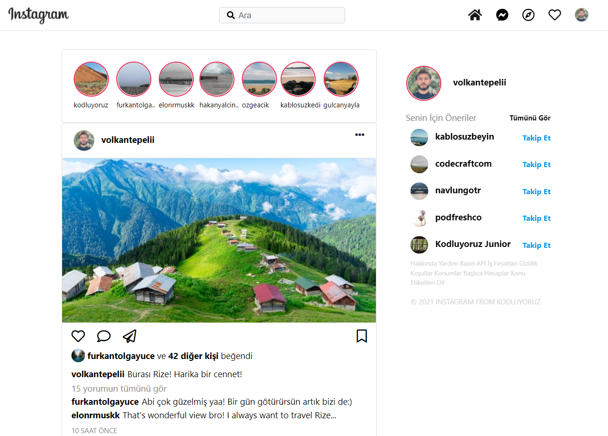

# instagrambootstrapclone
## Project purpose

```
To repeat the learned information by correcting the broken parts on the cloned Instagram using html, css and bootstrap technologies.
```

## Fix list

```
 - navbar is fixed up and boddy is padded
 - The height of the navbar should be 54px and the background color should be white.
 - First of all, give 192px left margin inside the logo class at the beginning of the navbar.
 - Take the search part in the middle with d-flex and give a margin of 5 units from the left.
 - Add the search icon in the assets folder to the background of the ::placeholder section in the CSS file. And make sure the picture doesn't repeat.
 - Give a margin of 5 units from the left and 2 units from the top to the menu section in the upper right.
 - Display the menu section in the upper right so that it disappears when the page is in sm size. You can check the Bootstrap Display property page for this.
 - The content area (the area where the posts are in the middle) should be offset 4 and should get a 2 unit margin from the top.
 - The maximum height in the middlearea that we specified in the Class should be 200px and you should write it with important.
 - Set the col of this field to 12 by default and all other scales to 6. In other words, set it to 12 in normal size, 6 scales as the page gets smaller and larger, and as you play with its size.
 - The three dots should be on the right in the content section.
 - There should be no borders on liking, commenting, sharing.
 - The offset of the bookmark icon should be 7 units.
 - Card header and card footers must be white.
 - Move the Share comment text to the right.
 - Do you think the space given to the right panel is sufficient? If not, fix it.
 - See all and follow the texts to the right.
 - Take the background color of the whole page from Instagram and apply it.
```

## Before ;

<hr>

## After ;


<br>
<br />

## Used technologies


