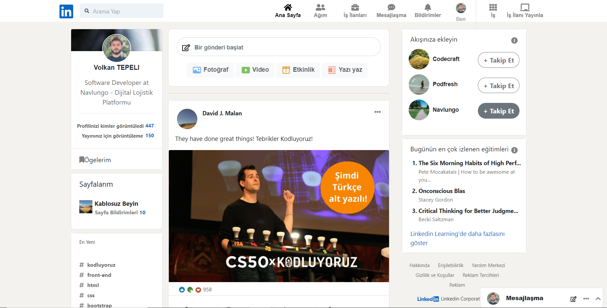

# linkedinbootstrapclone
# instagrambootstrapclone
## Project purpose

```
To repeat the learned information by correcting the broken parts on the cloned linkedin using html, css and bootstrap technologies.
```
## Broken instagram clone file

```
https://github.com/Kodluyoruz/taskforce/tree/main/bootstrap/odev3/bootstraplinkedinclone
```
## Fix list

```
 - fixed navbar up and added bleed
 - left space for logo
 - left space in search field and fixed placeholder
 - fixed space between search field and menu
 - texts and icons in menus are centered
 - profile pic fixed
 - content layout has been edited
 - For responsive structure; given left panel = 2, middle panel = 6, right panel = 3 units
 - Profile photo centered and border changed to round
 - posts have been reinstated
 - page notification count moved to right
 - sticky position given and overflow made visible
 - buttons edited in bootstrap
 - Apply #70B5F9 to Photo, #7FC15E to Video, #E7A33E to Activity, #F5987E to Text. Hint: fill
 - Pin the post sharing time down. Hint: align
 - Streamlined CSS written in inline-css
 - Margin given to likes, hearts and applause
 - The width of the message should be 300px, the background should be white.
```

## Before ;

<hr>

## After ;


<br>
<br />

## Used technologies


