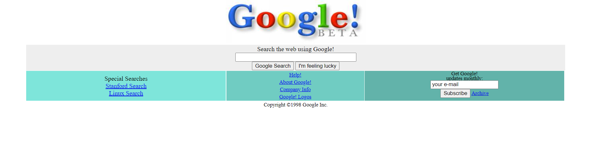

## google98 homepage created with html and css

## Project Purpose

```
Designing google 98 homepage using html and css
```
## link for google 98 home page original image

```
https://www.webdesignmuseum.org/gallery/google-1998
```
## used logo

```
https://web.archive.org/web/19990504112211im_/http://www.google.com/google.jpg
```
## notes

```
Buttons are not active. The project was carried out only to help develop skills on design.
```
<br>

<center></center>
<br>

## Used technologies


