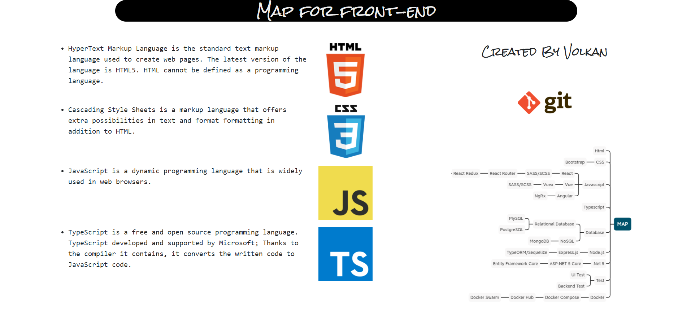

# path of web developer
## Project purpose
```
increase your css experience
```
## Task
```
updating the previous page
```

<a href="https://www.patika.dev/">task owner platform : patika.dev</a>

<a href="https://yemek.com/tarif/cikolatali-sufle/">page content source : roadmap.sh</a>

## Used technologies


